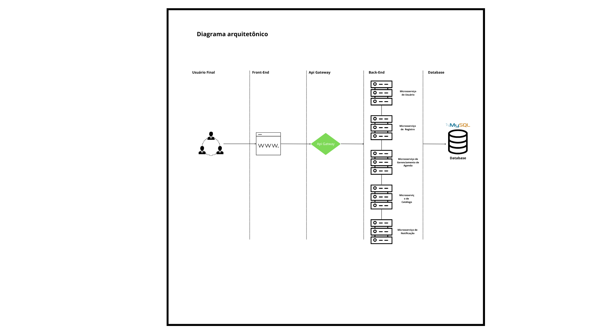

## Arquitetura e Design do Sistema

### Visão Geral da Arquitetura

O sistema "Agenday" é projetado com uma arquitetura baseada em microsserviços, utilizando uma separação clara entre o backend e o frontend para promover a modularidade e a escalabilidade. Abaixo, descrevemos os principais componentes da arquitetura:

- **Backend**:
  - Desenvolvido em **Java com Spring Boot**, o backend é dividido em vários microsserviços, cada um responsável por uma parte distinta da lógica de negócios. Isso inclui serviços para gerenciamento de usuários, agendamentos, gestão de instituições e especialidades.
  - **APIs RESTful** são expostas para permitir a comunicação entre o frontend e os microsserviços, facilitando a integração e a manutenção.

- **Frontend**:
  - Construído com **React**, o frontend fornece uma interface rica e responsiva para os usuários finais. Utiliza **Redux** para gerenciamento de estado, assegurando uma experiência de usuário coesa e performática.
  - Comunica-se com o backend através de chamadas HTTP para as APIs RESTful, manipulando dados dinamicamente e atualizando a UI sem necessidade de recarregamentos de página.

- **Servidor de Aplicação e Proxy**:
  - **Nginx** é usado tanto como servidor web quanto como proxy reverso, encarregado de servir o conteúdo estático do frontend e de encaminhar as requisições para os respectivos microsserviços no backend.

- **Banco de Dados**:
  - **MySQL** é utilizado para armazenar dados relacionais, como informações de usuário, detalhes de agendamentos e registros de instituições. Sua escolha deve-se à robustez, desempenho e facilidade de integração com Java.

### Diagramas de Arquitetura

Os diagramas de arquitetura fornecem uma visualização clara da estrutura e interação entre os componentes do sistema. (Nota: os diagramas devem ser criados e incorporados aqui utilizando ferramentas como Lucidchart, Draw.io, ou similares.)

1. **Diagrama de Arquitetura Geral**: Ilustra a relação entre o frontend, o backend (microsserviços), o servidor de aplicação e o banco de dados.

2. **Diagrama de Componentes**: Mostra os principais componentes do sistema e suas interações.

### Decisões de Design

As decisões de design foram guiadas pelos objetivos de negócios e pelos requisitos técnicos do projeto:

- **Uso de Microsserviços**: A escolha por uma arquitetura de microsserviços foi motivada pela necessidade de escalabilidade e flexibilidade. Permite a independência de desenvolvimento e implantação dos serviços, facilitando updates e manutenção.
- **Segurança em Camadas**: Implementação de segurança em múltiplas camadas, incluindo autenticação e autorização no backend, e medidas de segurança no proxy (Nginx).
- **Interface Responsiva**: O design focado em React e a gestão de estado via Redux garantem uma interface responsiva e dinâmica, essencial para a satisfação do usuário e para a performance do sistema em dispositivos diversos.

Estas decisões são fundamentais para suportar a escalabilidade, manutenibilidade, e segurança do sistema "Agenday", assegurando que ele não apenas atenda às necessidades atuais, mas também esteja preparado para futuras expansões e adaptações.

### Histórico de Versões

| Versão | Data       | Descrição            | Autor(es)              | Revisor(es) |
|--------|------------|----------------------|------------------------|-------------|
| `1.0`  | 06/05/2024 | Criação do Documento | Todos                  | -           |