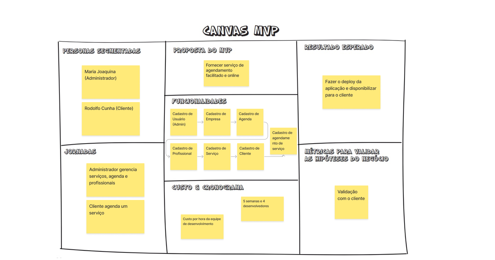

# Canvas MVP

O Canvas MVP (Minimum Viable Product) é uma ferramenta visual que auxilia na organização e priorização dos elementos essenciais de um produto mínimo viável. Ele ajuda a definir os componentes mais importantes do MVP para validação rápida e eficiente com os clientes-alvo.

## Seções do Canvas MVP

O Canvas MVP é composto pelas seguintes seções personalizadas:

- **Personas Segmentadas**: Identificar os perfis de usuários-alvo que você pretende atingir com o MVP. Determinar suas necessidades, dores e comportamentos relevantes para o produto.

- **Jornadas**: Descrever as jornadas dos usuários-alvo ao interagir com o produto, desde o início até a conclusão de suas tarefas ou objetivos.

- **Proposta do MVP**: Definir a proposta de valor específica que o MVP oferece ao mercado e aos usuários-alvo.

- **Funcionalidades**: Listar as funcionalidades essenciais do MVP que permitirão validar as hipóteses de negócio com os clientes.

- **Custo e Cronograma**: Identificar os custos estimados para o desenvolvimento do MVP e estabeleça um cronograma com marcos importantes para o projeto.

- **Resultado Esperado**: Descrever os resultados esperados com a implementação e validação do MVP, como feedback dos clientes, métricas de uso, entre outros.

- **Métricas para Validar as Hipóteses do Negócio**: Determinar as métricas que serão usadas para validar as hipóteses de negócio e avaliar o sucesso do MVP.

## Canvas MVP

Abaixo temos a imagem do Canvas MVP desenvolvido pelos integrantes da equipe para o projeto

### Histórico de Versões

| Versão | Data       | Descrição            | Autor(es)              | Revisor(es) |
|--------|------------|----------------------|------------------------|-------------|
| `1.0`  | 07/05/2024 | Criação do Documento | João Paulo Coelho                 | -           |