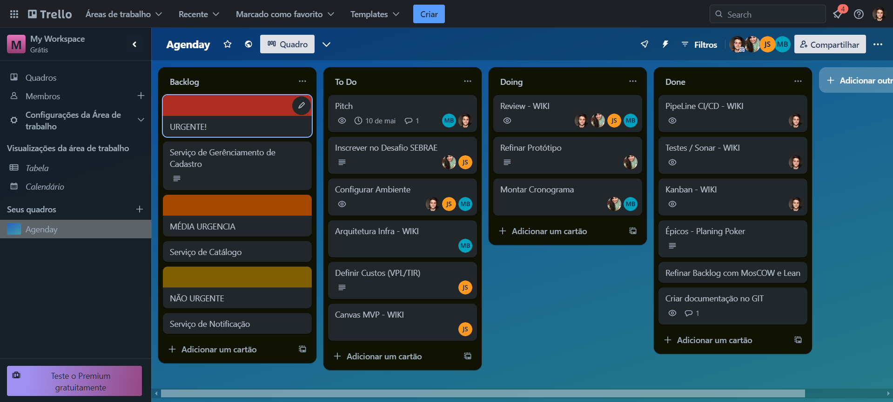

## Kanban

### O que é Kanban?

Kanban é um método visual de gerenciamento de trabalho que ajuda as equipes a ver claramente o fluxo de tarefas, identificar gargalos e otimizar os processos. Originalmente desenvolvido pela Toyota para a produção de carros, ele agora é amplamente utilizado em diversos setores, incluindo desenvolvimento de software.

### Para que Serve o Kanban?

1. **Visualização do Fluxo de Trabalho**: Torna visível cada etapa do processo, desde a tarefa ainda não iniciada até sua conclusão, usando cartões e colunas.
2. **Identificação de Gargalos**: Ajuda a localizar pontos de estrangulamento no fluxo para melhorá-los.
3. **Limite de Trabalho em Progresso (WIP)**: Evita que os membros da equipe trabalhem em múltiplas tarefas simultaneamente, concentrando-se em poucas tarefas para concluir rapidamente.
4. **Melhoria Contínua**: O acompanhamento contínuo permite ajustes no processo para aumentar a produtividade.

### Como é Usado o Kanban?

1. **Visualizar Tarefas**: As tarefas são representadas por cartões, organizados em colunas que representam estágios de progresso.
2. **Limitar o WIP**: As colunas têm limites claros de cartões para manter a eficiência.
3. **Regras Claras**: As políticas para mover os cartões entre colunas devem ser claras e bem definidas.
4. **Métricas de Desempenho**: Medir métricas como tempo de ciclo e lead time.

### Trello como uma Ferramenta de Kanban

O Trello é uma ferramenta que facilita a implementação do Kanban digitalmente. Ele permite criar quadros visuais com colunas e cartões que representam tarefas em diferentes estágios. Além disso, possibilita a integração de etiquetas, prazos e outras ferramentas de automação.

### Como o Kanban se Relaciona com o Scrum

Embora sejam métodos distintos, o Kanban pode ser incorporado dentro de equipes que utilizam o Scrum:

- **Sprints**: As equipes Scrum trabalham em ciclos curtos chamados sprints, e as tarefas de um sprint podem ser gerenciadas usando um quadro Kanban.
- **Reuniões**: As reuniões de planejamento, dailies e retrospectivas do Scrum se beneficiam do Kanban ao visualizar claramente o trabalho planejado e identificar gargalos.
- **Melhoria Contínua**: O Kanban traz uma perspectiva de melhoria contínua que complementa as retrospectivas regulares do Scrum.

### Quadro Kanban Agenday

[Acesse meu quadro do Trello aqui](https://trello.com/b/yeWCCFtv/agenday)

### Histórico de Versões

| Versão | Data       | Descrição            | Autor(es)              | Revisor(es) |
|--------|------------|----------------------|------------------------|-------------|
| `1.0`  | 06/05/2024 | Criação do Documento | Felipe                 | -           |