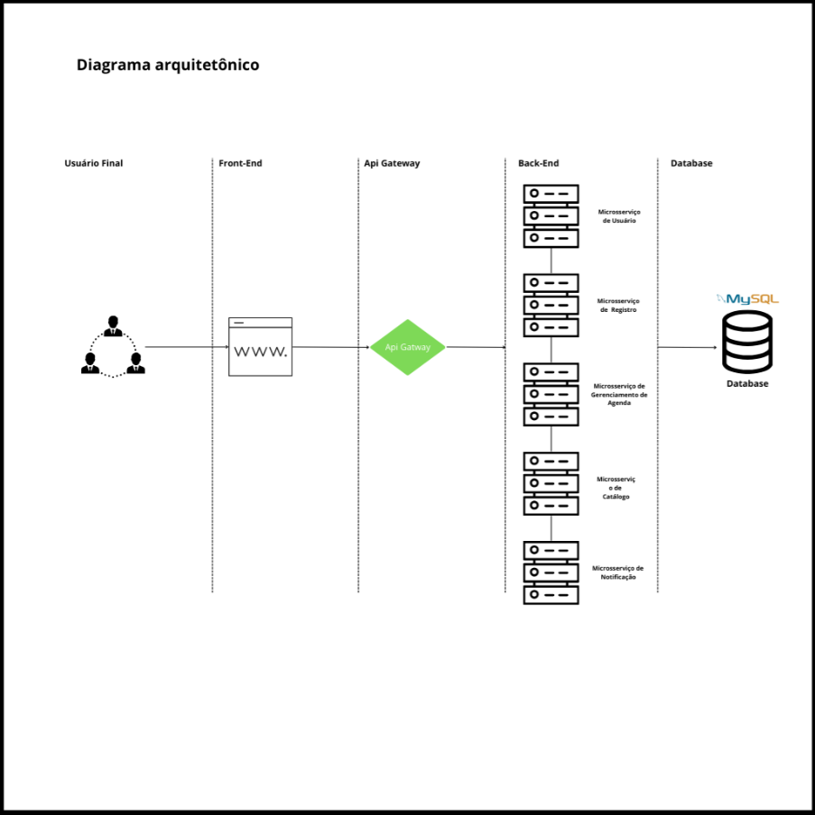

# Arquitetura do Sistema

Visão Geral da Arquitetura

O Sistema de Agenday  é projetado como um conjunto de microsserviços independentes, cada um responsável por uma parte específica do processo de negócio. Esta arquitetura baseada em microsserviços permite que o sistema seja escalável, resiliente e fácil de manter.&#x20;

Abaixo, descrevemos os principais componentes da arquitetura:

* **Backend**:
  * Desenvolvido em **Java com Spring Boot**, o backend é dividido em vários microsserviços, cada um responsável por uma parte distinta da lógica de negócios. Isso inclui serviços para gerenciamento de usuários, agendamentos, gestão de instituições e especialidades.
  * **APIs RESTful** são expostas para permitir a comunicação entre o frontend e os microsserviços, facilitando a integração e a manutenção.&#x20;
* **Banco de Dados**:
  * **MySQL** é utilizado para armazenar dados relacionais, como informações de usuário, detalhes de agendamentos e registros de instituições. Sua escolha deve-se à robustez, desempenho e facilidade de integração com Java.

#### Diagramas de Arquitetura 

Os diagramas de arquitetura fornecem uma visualização clara da estrutura e interação entre os componentes do sistema.

1. **Diagrama de Arquitetura Geral**: Ilustra a relação entre o frontend, o backend (microsserviços), o servidor de aplicação e o banco de dados.

<figure><figcaption></figcaption></figure>

Os microsserviços comunicam-se principalmente via RESTful APIs, utilizando JSON para a troca de dados. O API Gateway centraliza as solicitações externas, distribuindo-as conforme necessário.&#x20;

**Segurança**

Cada microsserviço é protegido por autenticação e autorização baseadas em tokens JWT (JSON Web Tokens), garantindo que apenas usuários autorizados possam acessar os serviços. Além disso, o tráfego entre serviços é criptografado usando TLS para garantir a segurança dos dados em trânsito.

#### Conclusão

A arquitetura do Sistema de Gerenciamento de Pedidos é projetada para maximizar a eficiência, escalabilidade e segurança, aderindo às práticas recomendadas de microsserviços. Esta configuração não apenas facilita o gerenciamento individual de cada componente, mas também assegura a robustez e a flexibilidade necessárias para adaptar-se a novos requisitos de negócios e tecnologias emergentes.
