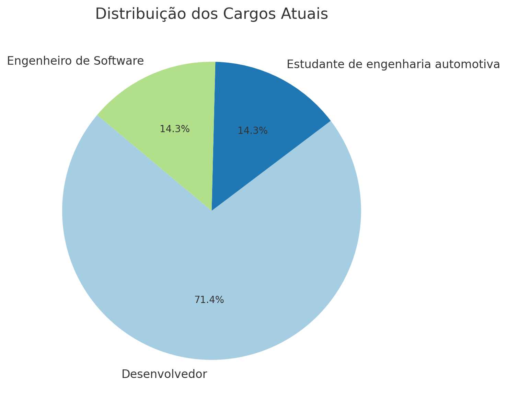

# Pesquisa de Usabilidade

### Introdução

Nesta seção, apresentamos os resultados da pesquisa realizada para avaliar a usabilidade e a eficácia do Catálogo de Boas Práticas de Microserviços. A pesquisa contou com a participação de diversos profissionais da área, cujas respostas foram analisadas e apresentadas nos gráficos a seguir.

### Metodologia

A pesquisa foi conduzida com os seguintes detalhes:

* **Número de participantes**: 7
* **Tipos de perguntas**: Classificação da experiência, sugestões abertas, dados demográficos.
* **Data de realização da pesquisa**: 25 de junho de 2024.

### Resultados

**Classificação da Experiência Geral**

A maioria dos respondentes classificou a experiência geral com o catálogo como "Excelente" ou "Boa". O gráfico abaixo mostra a distribuição das respostas:

<figure><figcaption></figcaption></figure>

**Distribuição dos Cargos Atuais**

Os respondentes ocupam diversos cargos, majoritariamente desenvolvedores e engenheiros de software. A distribuição dos cargos está representada no gráfico a seguir:

<figure><figcaption></figcaption></figure>

**Distribuição dos Anos de Experiência**

A pesquisa abrangeu profissionais com uma ampla gama de experiências, desde menos de 1 ano até mais de 10 anos. O gráfico abaixo ilustra a distribuição dos anos de experiência dos respondentes:

<figure><figcaption></figcaption></figure>

#### Sugestões de Melhoria

Além das classificações, os participantes também forneceram sugestões de melhoria para o catálogo. Algumas das sugestões mais comuns foram:

* Inclusão de mais imagens e exemplos visuais.
* Melhor organização das seções.
* Adição de novos tópicos relevantes.

### Conclusão

A pesquisa indicou uma avaliação positiva geral do catálogo, com várias sugestões construtivas para futuras melhorias. Esses insights serão usados para aprimorar ainda mais o conteúdo e a usabilidade do Catálogo de Boas Práticas de Microserviços.

### Agradecimentos

Agradecemos a todos os participantes que contribuíram com suas opiniões e sugestões valiosas.
