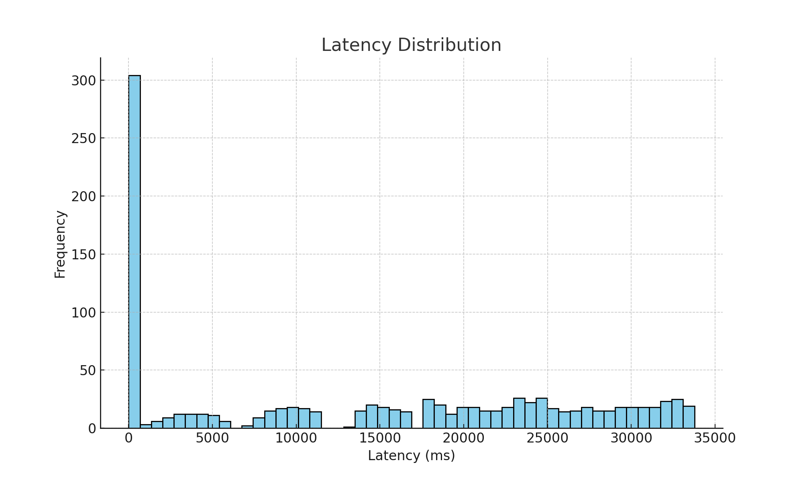
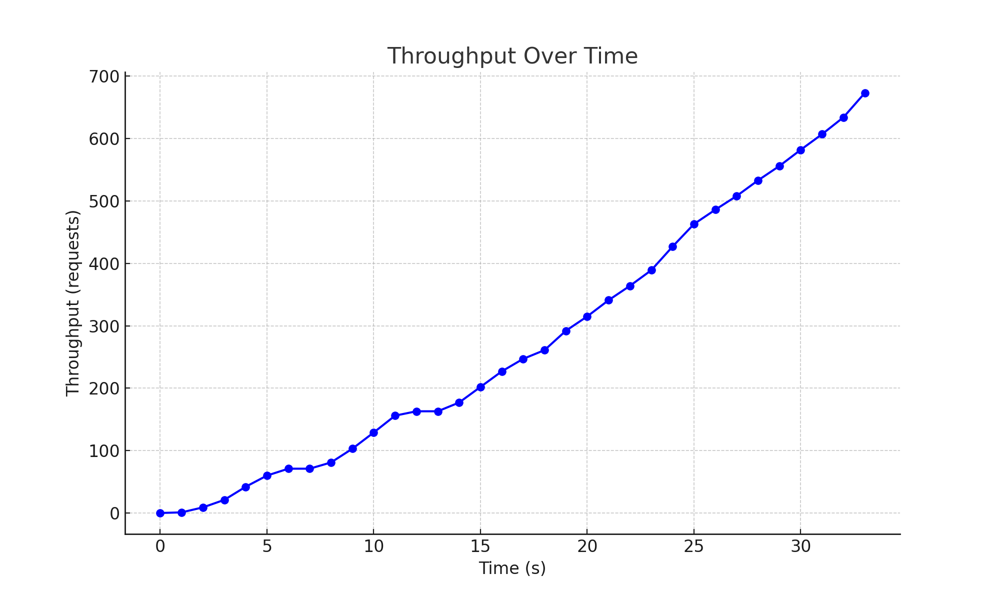
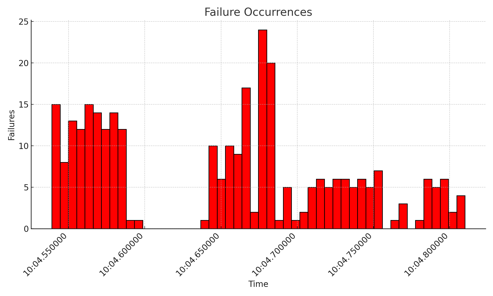

# Poc 1

## PoC 1 - Microsserviço Baseado em Domínios de Negócio

### Definição da PoC

**Objetivo:** Demonstrar a criação eficaz de um microsserviço do zero, focando em um domínio de negócio específico para ilustrar como a modularização pode ser realizada de acordo com as necessidades de negócios.

### Requisitos da PoC

1. Identificação do Domínio de Negócio: Agendamento de Consultas.
2.  Definição dos Requisitos: Para a definição dos requisitos, foi utilizado um product backlog, que é uma lista dinâmica e ordenada das funcionalidades desejadas para o produto. Essa lista foi organizada e priorizada utilizando a técnica MoSCoW (Must have, Should have, Could have, Won't have this time). Essa técnica permite a priorização eficaz dos requisitos, classificando-os em quatro categorias principais:

    * Must have: Requisitos essenciais que devem ser implementados para que o produto seja considerado funcional.
    * Should have: Requisitos importantes que são desejáveis, mas não essenciais para o funcionamento básico do produto.
    * Could have: Requisitos que são desejáveis, mas não são críticos e podem ser implementados se houver tempo e recursos disponíveis.
    * Won't have this time: Requisitos que são reconhecidos, mas que não serão implementados na presente iteração.

    Através dessa metodologia, foi possível garantir que os requisitos mais críticos e de maior valor para os usuários fossem priorizados e implementados primeiro.

### Épico 01 - Gerenciamento de Instituições 

| ID     | Descrição                                                                                                           | Critérios de Aceitação                                                                                         | Priorização |
| ------ | ------------------------------------------------------------------------------------------------------------------- | -------------------------------------------------------------------------------------------------------------- | ----------- |
| REQ004 | Como administrador, quero cadastrar uma nova instituição com detalhes como nome, tipo, endereço e contato.          | Formulário de cadastro com campos obrigatórios. Validação dos dados inseridos.                                 | Must Have   |
| REQ005 | Como administrador, quero atualizar ou remover instituições para manter as informações corretas e atualizadas.      | Opções de editar e excluir para cada instituição cadastrada. Confirmação antes da exclusão de uma instituição. | Must Have   |
| REQ006 | Como administrador, quero visualizar detalhes completos das instituições cadastradas para gerenciar eficientemente. | Lista detalhada com todas as instituições. Opções para visualizar mais detalhes de cada instituição.           | Should Have |

### Épico 02 - Gerenciamento de Especialidades 

| ID     | Descrição                                                                                                      | Critérios de Aceitação                                                                                 | Priorização |
| ------ | -------------------------------------------------------------------------------------------------------------- | ------------------------------------------------------------------------------------------------------ | ----------- |
| REQ007 | Como administrador, quero adicionar novas especialidades ao sistema para diversificar os serviços oferecidos.  | Formulário para inserção de nova especialidade. Validação dos dados inseridos.                         | Must Have   |
| REQ008 | Como administrador, quero editar ou remover especialidades para atualizar ou simplificar a oferta de serviços. | Opções de editar e excluir para cada especialidade. Confirmação antes da remoção de uma especialidade. | Should Have |

### Épico 03 - Gerenciamento de Colaboradores 

| ID     | Descrição                                                                                                                                                   | Critérios de Aceitação                                                                                                                                                                                                             | Priorização |
| ------ | ----------------------------------------------------------------------------------------------------------------------------------------------------------- | ---------------------------------------------------------------------------------------------------------------------------------------------------------------------------------------------------------------------------------- | ----------- |
| REQ009 | Como administrador, quero cadastrar colaboradores no sistema, incluindo informações como nome, CPF, e-mail, e seus horários disponíveis.                    | Formulário de cadastro com campos para nome, CPF, e-mail e horários disponíveis. Validação dos dados inseridos para garantir a precisão das informações. Possibilidade de definir múltiplos intervalos de disponibilidade por dia. | Must Have   |
| REQ010 | Como administrador, quero atualizar ou remover colaboradores para manter a equipe atualizada com as necessidades do serviço.                                | Opções de editar e excluir para cada colaborador cadastrado. Capacidade de alterar informações pessoais e ajustar horários disponíveis. Confirmação antes da exclusão de um colaborador.                                           | Must Have   |
| REQ011 | Como administrador, quero gerenciar os horários de disponibilidade de cada colaborador para atualizar ou bloquear horários específicos conforme necessário. | Interface para visualizar e modificar os horários disponíveis de cada colaborador. Funcionalidade para adicionar, editar ou remover blocos de disponibilidade. Visualização clara de horários já agendados para evitar conflitos.  | Should Have |

### Épico 04 - Gerenciamento de Agendamentos 

| ID     | Descrição                                                                                              | Critérios de Aceitação                                                                                                                             | Priorização |
| ------ | ------------------------------------------------------------------------------------------------------ | -------------------------------------------------------------------------------------------------------------------------------------------------- | ----------- |
| REQ012 | Como cliente, quero agendar serviços diretamente pelo sistema para facilitar a gestão do meu tempo.    | Interface simplificada para seleção de serviço, data e horário. Confirmação imediata do agendamento.                                               | Must Have   |
| REQ013 | Como cliente, quero cancelar ou reagendar serviços para ajustar meus compromissos conforme necessário. | Opções de cancelamento e reagendamento acessíveis na área do cliente. Notificações enviadas ao prestador de serviço e ao cliente sobre alterações. | Should Have |

### Épico 05 - Catálogo de Serviços 

| ID     | Descrição                                                                                                                | Critérios de Aceitação                                                                                                                                               | Priorização |
| ------ | ------------------------------------------------------------------------------------------------------------------------ | -------------------------------------------------------------------------------------------------------------------------------------------------------------------- | ----------- |
| REQ014 | Como cliente, quero visualizar um catálogo de serviços para escolher o serviço que melhor atenda às minhas necessidades. | Listagem de todos os serviços disponíveis com detalhes como descrição, preço e duração. Funcionalidades de filtragem por categoria, localização e avaliação.         | Must Have   |
| REQ015 | Como administrador, quero adicionar serviços ao catálogo para disponibilizar mais opções aos clientes.                   | Formulário para inserção de novos serviços com campos para nome, descrição, preço e duração. Validação dos dados inseridos para garantir a precisão das informações. | Should Have |
| REQ016 | Como administrador, quero atualizar ou remover serviços do catálogo para manter as informações corretas e atuais.        | Opções de editar e excluir para cada serviço listado. Confirmação antes da exclusão de um serviço.                                                                   | Could Have  |

### Análise dos Resultados da Poc

A análise de resultados envolveu a avaliação desta PoC em diversos termos de desempenho técnico. Os dados foram coletados em uma aplicação local rodando em um container. Os testes foram realizados no JMeter com 1000 threads, simulando 1000 usuários quase simultâneos fazendo requisições.

### Desempenho Operacional

<figure><figcaption>
Fonte : Autor
</figcaption></figure>

1. **Latência Média** (tempo que leva para uma requisição ser processada):

* A latência média foi calculada como 48.45 ms.

2. **Throughput**( número de requisições bem-sucedidas):

* O throughput foi calculado como 20.64 operações por segundo.

3. **Distribuição da Latência**:

<figure><figcaption>
fonte : Autor
</figcaption></figure>

Este histograma mostra a frequência das latências observadas nas requisições. No gráfico acima, cada barra representa o número de requisições que tiveram uma latência dentro de um intervalo específico. Por exemplo, se uma barra está alta na posição "50 ms", isso significa que muitas requisições foram processadas em cerca de 50 milissegundos. Este gráfico ajuda a identificar se a maioria das requisições está sendo processada rapidamente ou se há um número significativo de requisições com latências mais altas.

4. **Throughput ao Longo do Tempo**

<figure><figcaption>
Fonte : Autor
</figcaption></figure>

Este gráfico de linha mostra o número de requisições bem-sucedidas ao longo do tempo. Ele ajuda a entender como o throughput do microsserviço varia durante o período de teste.

5. **Ocorrências de Falhas**

<figure><figcaption>
fonte : Autor
</figcaption></figure>

Este histograma mostra a distribuição das falhas ao longo do tempo. Ele indica em quais momentos ocorreram falhas nas requisições. Cada barra representa o número de falhas que ocorreram em um intervalo de tempo específico. A maioria dessas falhas ocorreram devido a limitações ao gerenciar múltiplas conexões ao banco de dados MySQL em um ambiente Docker local. Essas limitações na rede interna do Docker resultaram em falhas nas conexões , onde a aplicação não conseguiu estabelecer novas conexões com o banco de dados MySQL devido à exaustão dos recursos de rede.

6. **Uso de CPU e Memória**:

* Os dados de uso de CPU e memória foram coletados utilizando o Grafana com o Prometheus. A métrica `process_cpu_usage{}` foi utilizada para medir a porcentagem de uso de CPU, e a métrica `jvm_memory_used_bytes{area="heap", id="G1 Old Gen"}` foi utilizada para medir a quantidade de memória usada pela geração "Old" do Garbage Collector G1. A "Old Generation" (ou "Geração Antiga") no contexto do Garbage Collector (GC) é onde os objetos de longa duração são armazenados. Monitorar essa área específica é crucial porque ela pode impactar significativamente o desempenho da aplicação, especialmente durante a execução do GC, quando a "Old Generation" é coletada. Se essa área estiver frequentemente cheia ou se estiver crescendo rapidamente, pode indicar problemas de retenção de memória ou a necessidade de tuning do GC.

<figure><figcaption>
fonte : Autor
</figcaption></figure>

* **Uso de CPU**: O gráfico mostra que o uso de CPU varia, com um valor máximo de aproximadamente 0.06%.
* **Uso de Memória**: O gráfico indica que o uso de memória na geração "Old" do Garbage Collector G1 varia entre 39 MB e 43 MB.

### Conclusão

A partir dos dados analisados, observa-se que a latência média do microsserviço está razoavelmente baixa, indicando um bom tempo de resposta. O throughput é bom, mas pode ser melhorado. A presença de 304 falhas pode ser atribuída a fatores como as limitações do ambiente local com contêineres, o que sugere que esses números podem ser mais favoráveis em um ambiente de produção otimizado.

Grande parte dessas falhas ocorreu devido a limitações ao gerenciar múltiplas conexões ao banco de dados MySQL em um ambiente Docker local. Essas limitações na rede interna do Docker resultaram em falhas nas conexões, onde a aplicação não conseguiu estabelecer novas conexões com o banco de dados MySQL devido à exaustão dos recursos de rede.

Como os dados foram coletados em um ambiente local rodando em contêineres, é provável que o desempenho em um ambiente de produção real seja diferente. Fatores como a configuração da infraestrutura, o balanceamento de carga e o tráfego de rede podem impactar significativamente os resultados. As limitações do ambiente local com contêineres podem ter impactado tanto o throughput quanto o número de falhas observadas, sugerindo que esses números podem ser mais favoráveis em um ambiente de produção otimizado.

Além disso, grande parte do impacto ocasionado por essas conexões foi sanada na PoC 3 com a implementação do Circuit Breaker. Esta solução ajudou a melhorar a resiliência do sistema e a reduzir o número de falhas de conexão, proporcionando uma maior estabilidade e confiabilidade ao microsserviço.

O código fonte do microsserviço pode ser encontrado no seguinte repositório: [GitHub - Agenday Registry Service](https://github.com/mateusbrandaot/TCC2\_Microservices/tree/main/agenday/registry).
